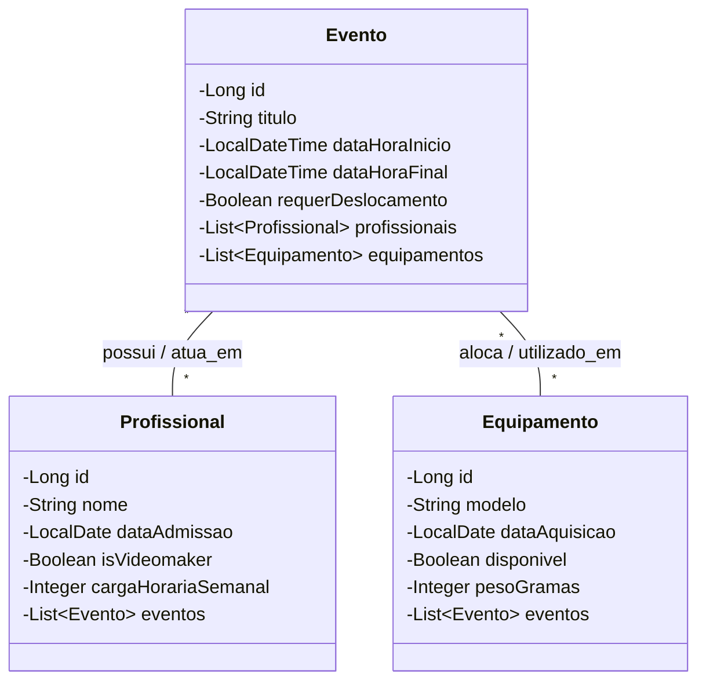

# GerenciadorDeAgendasSECOM
Um gerenciador de agenda de profissionais de comunicação, um projeto simples para a aprovação na matéria de desenvolvimento web

```mermaid
classDiagram
    direction TB

    class Profissional {
        -Long id
        -String nome
        -LocalDate dataAdmissao
        -Boolean isVideomaker
        -Integer cargaHorariaSemanal
        -List~Evento~ eventos
    }

    class Evento {
        -Long id
        -String titulo
        -LocalDateTime dataHoraInicio
        -LocalDateTime dataHoraFinal
        -Boolean requerDeslocamento
        -List~Profissional~ profissionais
        -List~Equipamento~ equipamentos
    }

    class Equipamento {
        -Long id
        -String modelo
        -LocalDate dataAquisicao
        -Boolean disponivel
        -Integer pesoGramas
        -List~Evento~ eventos
    }

    %% Relacionamentos N:N mapeados nas listas
    Evento "*" -- "*" Profissional : possui / atua_em
    Evento "*" -- "*" Equipamento : aloca / utilizado_em
```
